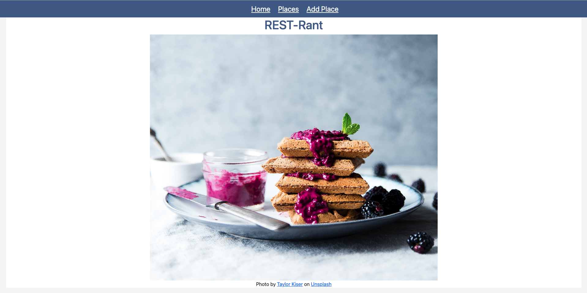
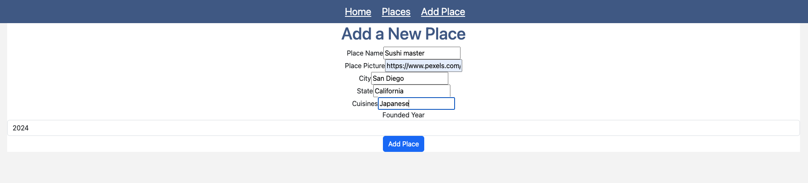
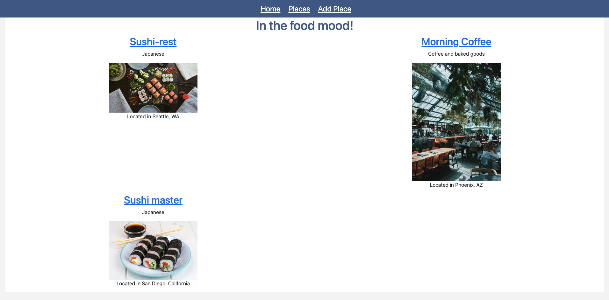
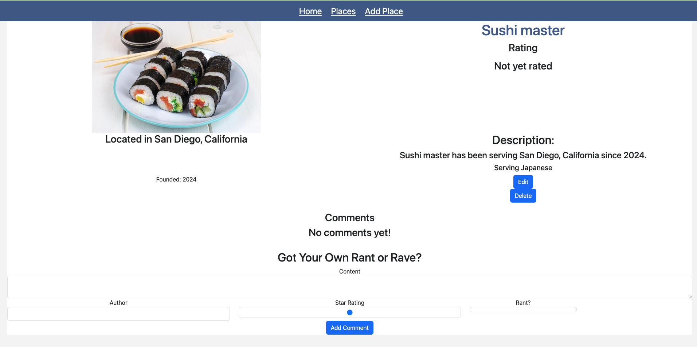

# Project: REST-Rant
Completed by Crisila Ballecer

## Description
REST-Rant is an app where users can review restaurants.


## Demo
Once dependcies are installed and application is running:




To add a restaurant, click 'Add Place' and enter restaurant informations:



Once a restaurant is added, the user can add a review and edit place:





## Techonologies
The following dependecies are required for this project:

```json
{
  "dependencies": {
    "dotenv": "^16.4.5",
    "express": "^4.19.2",
    "express-react-views": "^0.11.0",
    "method-override": "^3.0.0",
    "mongoose": "^8.3.3",
    "nodemon": "^3.1.0",
    "react": "^16.14.0",
    "react-dom": "^16.14.0"
  }
}
```

## Technical Information
### Installation

To run this project locally, follow these steps:

1. Clone the repository:
   ```bash
   git clone https://github.com/Crisila/project-REST-rant2.git
   cd your-repository
   ```

2. Install the dependencies:
   ```bash
   npm install
   ```

3. Start the server:
   ```bash
   npm start
   ```

4. View the website at: http://localhost:3000/


## Issues
- [ ] Fix and add css to the form page
- [ ] Add more CSS to the index page
- [ ] Add more CSS to the details page
- [ ] Add more CSS to the rant page
- [ ] Add more CSS to the rant edit page
- [ ] Add more CSS to the rant delete page
- [ ] Responsiveness
- [ ] Add Register page
- [ ] Add login page
- [ ] Add logout page


## API Documentation
| **Method** | **Path**                 | **Purpose**                                      |
|------------|--------------------------|--------------------------------------------------|
| GET        | /                        | Home Page                                        |
| GET        | /places                  | Places index page                                |
| POST       | /places                  | Create new place                                 |
| GET        | /places/new              | Form page for creating a new place               |
| GET        | /places/:id              | Details about a particlular place                |
| PUT        | /places/:id              | Update a particular place                        |
| GET        | /places/:id/edit         | Form page for editing an existing place          |
| DELETE     | /places/:id              | Delete a particular place                        |
| POST       | /places/:id/rant         | Create a rant(commment) about a particular place |
| DELETE     | /places/:id/rant/:rantId | Delete a rant (comment) about a particular place |
| GET        | *                        | 404 page (matches any route not defined above)   |


| **Field** | **Type**  |
|-----------|-----------|
| _id       | Object ID |
| name      | string    |
| city      | string    |
| state     | string    |
| cuisines  | string    |
| pic       | string    |


## Credits:

sushi-rest
Photo by <a href="https://unsplash.com/@jckbck?utm_content=creditCopyText&utm_medium=referral&utm_source=unsplash">Jakub Dziubak</a> on <a href="https://unsplash.com/photos/sushi-on-black-ceramic-plate-iOHJKJqO6E0?utm_content=creditCopyText&utm_medium=referral&utm_source=unsplash">Unsplash</a>

second-rest
Photo by <a href="https://unsplash.com/@kayleighharrington?utm_content=creditCopyText&utm_medium=referral&utm_source=unsplash">kayleigh harrington</a> on <a href="https://unsplash.com/photos/group-of-people-inside-the-restaurant-yhn4okt6ci0?utm_content=creditCopyText&utm_medium=referral&utm_source=unsplash">Unsplash</a>
  
  

